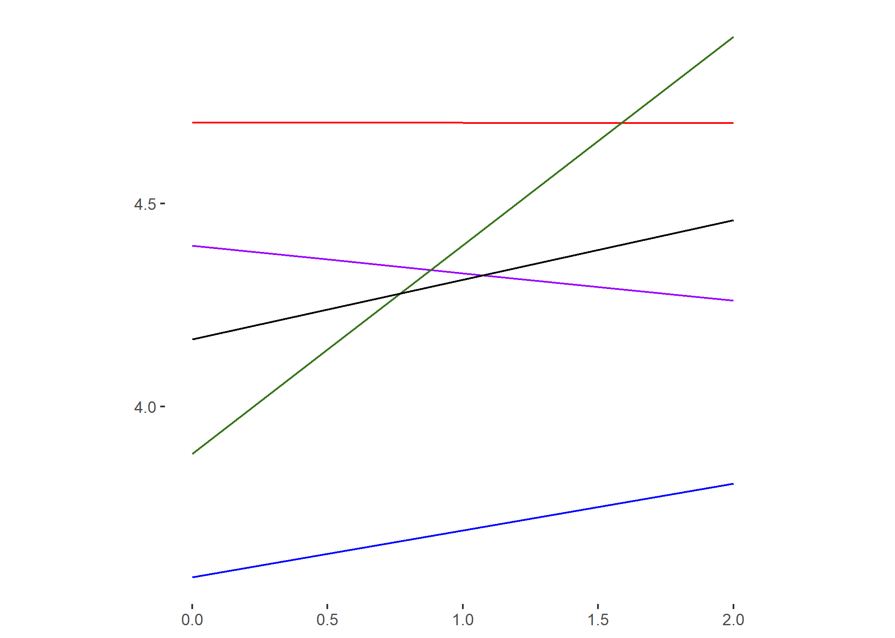

# Replicated Eye-Tracking Call Graph Analysis

### TABLE V: Call Graph Coverage and Summary Quality
| Graph | Study | Node Coverage | Weighted Node Coverage | Edge Coverage | Weighted Edge Coverage |
|-------|-------|---------------|------------------------|---------------|------------------------|
| Caller | Study 1 | -0.843 | -6.481 | -0.786 | -7.259 |
| | Study 2 | 0.749 | 2.779 | -0.361 | -2.672 |
| | Combined | 0.079 | -1.763 | -0.293 | -2.381 |
| Callee | Study 1 | -0.268 | 2.050 | 0.220 | 1.786 |
| | Study 2 | -0.020 | 9.107 | 1.822 | 8.227 |
| | Combined | -0.067 | 3.013 | 0.585 | 2.656 |

### TABLE VI: Callee Graph Coverage and Summary Quality Subscores
| Subscore | Node Coverage | Weighted Node Coverage | Edge Coverage | Weighted Edge Coverage |
|----------|---------------|------------------------|---------------|------------------------|
| Accuracy | -0.106 | 0.077 | -0.001 | 0.240 |
| Conciseness | 0.012 | 0.778 | 0.115 | 0.463 |
| Completeness | 0.161 | 1.396 | 0.513 | 1.140 |
| Clarity | -0.114 | 0.200 | -0.068 | 0.302 |

*(Note: Make sure `subscore_reg.png` is in the same folder as this markdown file for the image to load properly).*

### TABLE VII: Call Graph Coverage and Confidence
| Graph | Study | Node Coverage | Weighted Node Coverage | Edge Coverage | Weighted Edge Coverage |
|-------|-------|---------------|------------------------|---------------|------------------------|
| Caller | Study 1 | -0.235 | -1.944 | 0.090 | -1.139 |
| | Study 2 | 0.268 | 1.316 | -0.010 | -0.231 |
| | Combined | -0.022 | -0.506 | 0.053 | -0.353 |
| Callee | Study 1 | -0.384 | -0.362 | -0.420 | -0.418 |
| | Study 2 | -0.076 | 1.166 | 0.302 | 2.752 |
| | Combined | -0.111 | -0.175 | -0.205 | -0.073 |

### TABLE VIII: Call Graph Coverage and Absolute Confidence Difference
| Graph | Study | Node Coverage | Weighted Node Coverage | Edge Coverage | Weighted Edge Coverage |
|-------|-------|---------------|------------------------|---------------|------------------------|
| Caller | Study 1 | -3.824 | -29.760 | -1.753 | -30.560 |
| | Study 2 | 1.060 | 25.094 | 16.973 | 56.696 |
| | Combined | -2.084 | -9.936 | 4.699 | 22.409 |
| Callee | Study 1 | 2.555 | 31.220 | 4.135 | 23.675 |
| | Study 2 | -1.905 | -109.689 | -12.924 | -56.545 |
| | Combined | -1.973 | 15.169 | -0.170 | 18.219 |
